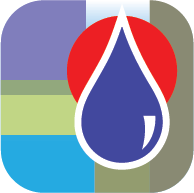
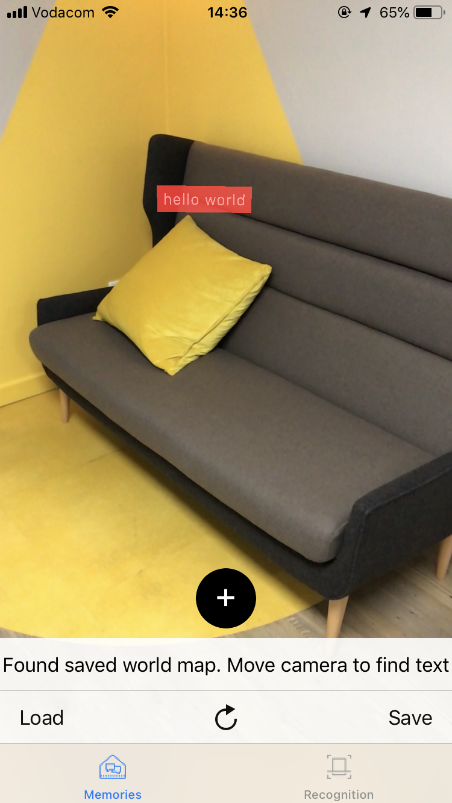

# DropMemory

	

DropMemory is an iOS app that combines augmented reality (AR) and social networking. Using the app, and the help of AR, the user can leave a message in a real-world environment and save this message to the cloud. Other users can then find the messages that you left, and add their own messages  

In addition, this app has a feature that uses object recognition to provide information about the 2019 DVT graduates' mascots

## Key Features
### DropMemory
Use the app to leave AR messages for other users to find

### Recognition
Use the app to find out more information about the DVT graduates' mascots

## Getting Started

### Using the DropMemory feature
* Finding memories
    * Open the app and select the Messages feature on the bottom tab if not already selected
    * Wait for the app to download the messages
    * Use the phone to search for messages in the environment
    * Messages will appear in white text on a red background
    
* Leaving memories
    * Open the app and select the Messages feature on the bottom tab if not already selected
    * Look at the location where you want to leave a message and tap on the plus button at the bottom of the screen
    * A popup will appear where a message can be entered
    * Type a message and tap on the Ok button
    * Your message will appear
    * Tap the Save button

### Using object recognition
* Open the app and select the Recognition feature on the bottom tab in not already selected
* Use the app and look at a DVT mascot

## Technologies used
* App developed in Swift
* ARKit library
* CoreLocation

## Credits

This app was built with and uses the following:
 
* Google Firebase 

## Authors
* Divine Dube
* Marie Harmsen
* Prateek Kambadkone
* David Minders
* Zaheer Moola

## Acknowledgments
* We would like to thank Prateek Kambadkone for providing the hardware that enabled testing of the app
* We would like to thank the DVT UX graduates for the app icon 

